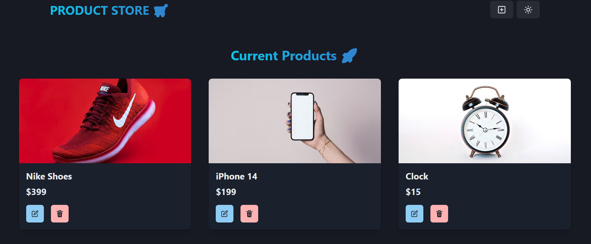

# Basic Full Stack Project

# 🛍️ Product Store – MERN Stack Application

A full-stack eCommerce-style web application built using the **MERN stack** (MongoDB, Express, React, Node.js). The Product Store allows users to **create, read, update, and delete** (CRUD) products with a name/title, price, and image.

---

## 🚀 Features

- ✅ View a list of all added products  
- 🛍 **Add new products** with title, price, and image.  
- ❌ **Delete products** from the inventory.
- ⚡ **Fast and responsive UI** built with React.
- 🔄 **Edit product details** dynamically.
- ✅ Dynamic UI updates in real-time without reloading  
- ✅ RESTful API built with Express and MongoDB  
- ✅ Responsive frontend built with React
- 📂 **Store product data** in MongoDB.

---

## 🖼 Screenshots
### **Create Product Page**
This page allows users to add new products with a name, price, and image.

### **Display Product Page**
This page lists all added products, allowing users to update or delete them.

---

## 🚀 Technologies Used
### **Frontend**
- **Framework:** React.js (`react`, `react-dom`)
- **Routing:** React Router (`react-router-dom`)
- **State Management:** Zustand (`zustand`)
- **UI Library:** Chakra UI (`@chakra-ui/react`, `@chakra-ui/icons`)
- **Animations:** Framer Motion (`framer-motion`)
- **Styling:** Emotion (`@emotion/react`, `@emotion/styled`)
- **Icons:** React Icons (`react-icons`)
- **Development Tools:** Vite (`vite`, `@vitejs/plugin-react`), ESLint (`eslint`, `eslint-plugin-react`, `eslint-plugin-react-hooks`, `eslint-plugin-react-refresh`)
  
### **Backend**
- **Server Framework:** Express.js (`express`)
- **Database:** MongoDB with Mongoose (`mongoose`)
- **Environment Variables:** Dotenv (`dotenv`)
- **Development Tools:** Nodemon (`nodemon`), Cross-env (`cross-env`)

## 🤝 Contributions
Feel free to contribute! Open a pull request if you'd like to enhance any feature.